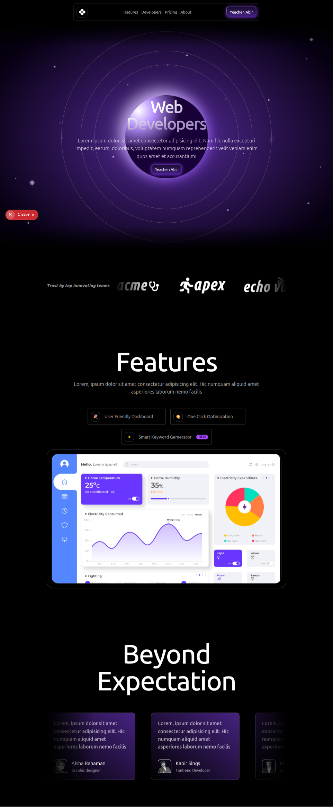
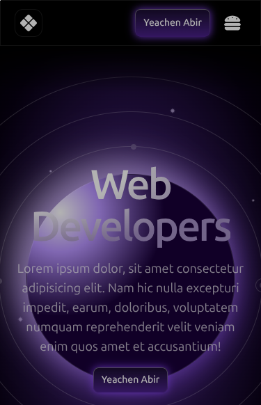

# 🚀 Galaxy Web Developers Landing Page

A stunning, responsive landing page template built for **Web Developers**, startups, and SaaS products. Designed with modern UI/UX principles and loaded with powerful features.

## 📱 Responsive Design

Fully optimized for all devices – from widescreen desktops to smartphones.

  

---

## ✨ Features

- 🌙 **Dark Themed UI**
- 📊 Feature-Rich Dashboard Mockup
- ⚙️ One-Click Optimization
- 🔍 Smart Keyword Generator
- 🛠️ Built with modern frontend tools
- 💯 Beyond Expectations – backed by user testimonials

---

## 🧠 Tech Stack

- **React.js**, **Next.js**
- **HTML5**, **CSS3**, **Tailwind CSS**
- **JavaScript** (Vanilla / React-ready)
- **Responsive Design Principles**

---

## 🌐 Live Preview

> 🟣 Coming Soon: [Visit Live Site](coming soon)

---

## 👨‍💻 Developer

Made with ❤️ by [Yeachen Abir](https://github.com/Mdyeachen)

---

## 📂 Project Structure

── app
│   ├── favicon.ico
│   ├── globals.css
│   ├── layout.js
│   └── page.js
├── assets
│   ├── feature-ana.png
│   ├── logo-ticker
│   │   ├── acme.png
│   │   ├── apex.png
│   │   ├── echo.png
│   │   ├── pulse.png
│   │   └── quatam.png
│   ├── Lottie
│   │   ├── click.json
│   │   ├── speed.json
│   │   └── star.json
│   ├── stars.png
│   └── teams
│       ├── 01.png
│       ├── 02.png
│       └── 03.png
├── component
│   ├── button.jsx
│   └── panet.jsx
└── sections
    ├── Feature.jsx
    ├── header.jsx
    ├── Hero.jsx
    ├── LogoTicker.jsx
    └── testimonial.jsx

