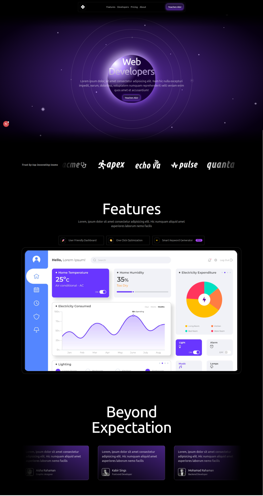
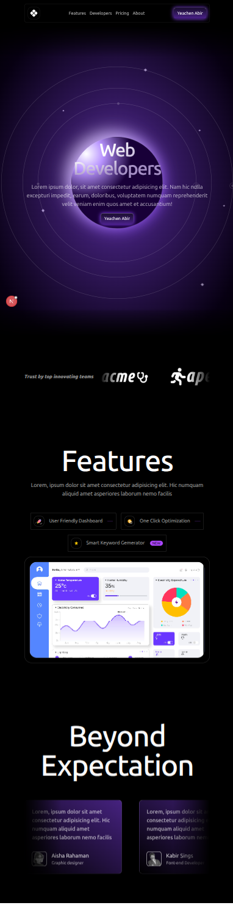
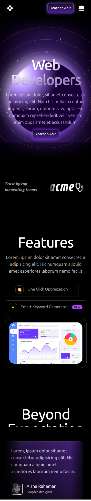

# 🚀 Galaxy – Web Developers Landing Page Template

**Galaxy** is a modern, responsive landing page template built with **Next.js** and **Tailwind CSS**, ideal for **web developers**, **startups**, **SaaS products**, and **tech portfolios**. Designed with clean UI/UX, speed, and SEO in mind.

---

## 🖼️ Template Preview

<p align="center">
  
  
  
</p>

---

## ✨ Key Features

- 🌑 Sleek **Dark Themed UI**
- ⚡ Performance-Optimized with Next.js
- 📱 Fully Responsive Design (Mobile, Tablet, Desktop)
- 🔍 **SEO Ready** with semantic structure
- 📊 Built-in Dashboard & Testimonials
- 🔧 Modern Development Stack with reusability in mind
- 🎯 Great for Developers, Portfolios & Tech Products

---

## ⚙️ Tech Stack

- **React.js** & **Next.js**
- **HTML5**, **CSS3**, **Tailwind CSS**
- **Vanilla JavaScript**
- **Responsive & Accessible Design**

---

## 📁 Folder Structure

```bash
src/
├── app/
│   ├── favicon.ico
│   ├── globals.css
│   ├── layout.js
│   └── page.js
├── assets/
│   ├── Lottie/         # Animation files
│   ├── logo-ticker/    # Client logos
│   ├── feature-ana.png
│   ├── stars.png
│   └── teams/          # Team member images
├── components/
│   ├── button.jsx
│   └── panel.jsx
└── sections/
    ├── Feature.jsx
    ├── Header.jsx
    ├── Hero.jsx
    ├── LogoTicker.jsx
    └── Testimonial.jsx
    
```

---

## 👨‍💻 Developed by Yeachen Abir

I am a passionate **Full-Stack Developer** with a strong focus on **custom website development**, **on-page SEO**, and **digital marketing** strategies. My mission is to craft web solutions that **look stunning**, **perform fast**, and **rank well** on search engines.

### 🌟 CMS Expertise:
- Shopify | BigCommerce | WordPress | Wix  
- Custom CMS with React.js & Next.js  
- eBay Store Design & Optimization  
- Walmart Marketplace Product Optimization  

### 💻 Technical Skills:
- **Frontend**: JavaScript, React.js, HTML, CSS, SCSS, Tailwind CSS, Bootstrap  
- **Backend**: Node.js, Express.js  
- **Database**: MongoDB  
- **Version Control**: Git & GitHub  

### 📈 SEO & Digital Marketing:
- Keyword Research & Meta Optimization  
- On-Page SEO & Content Enhancement  
- Technical SEO: Speed, Mobile, Schema  
- Google Analytics & Search Console  

### 🔗 Let’s Connect!
- 💼 [LinkedIn](https://www.linkedin.com/in/yeachen-abir/)  
- 📘 [Facebook Profile](https://www.facebook.com/yeachen.abir) | [Facebook Page](https://www.facebook.com/profile.php?id=61574159927866)  
- 🐦 [Twitter / X](https://x.com/YeachenA)  
- 📸 [Instagram](https://www.instagram.com/yeachenabir/)  
- 📌 [Pinterest](https://www.pinterest.com/yeachenabir/)  
- 📬 Email: [yeachenabir@gmail.com](mailto:yeachenabir@gmail.com)

---

## 💡 Why Choose the Galaxy Stitc Template?

✅ SEO-Friendly Markup  
✅ Fast & Responsive Layout  
✅ One Page Simplicity  
✅ Built With HTML5, CSS3, Tailwind CSS, React, Next, Frame Motion
✅ Developer Friendly & Easy to Customize  

---

> 🚀 Use this template to launch your business site, portfolio, or client project quickly and effectively.

**#yeachen #abir #webdeveloper #shopify #wordpress #ecommerce #custom_website #react_developer #next_developer #full_stack_developer**

---
